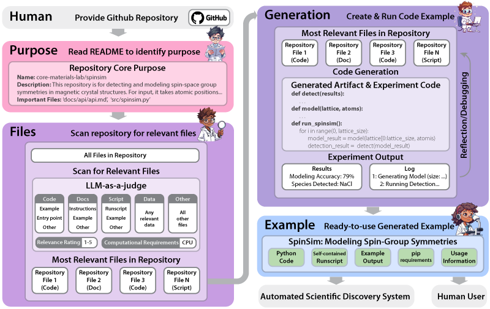
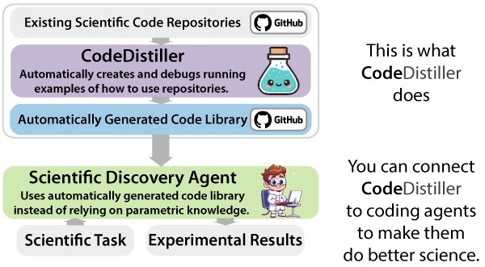
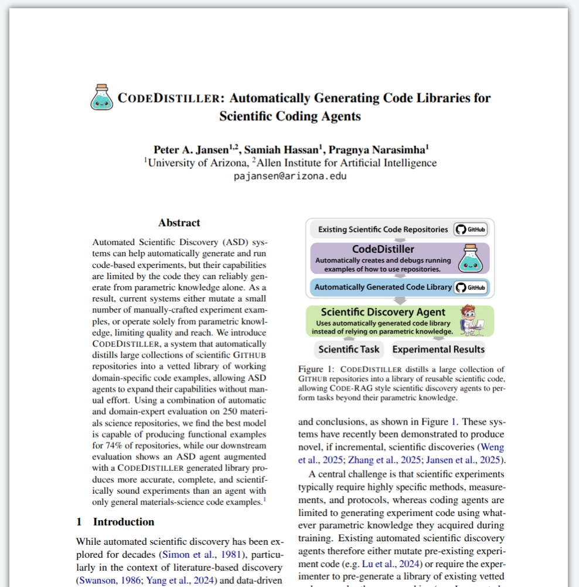
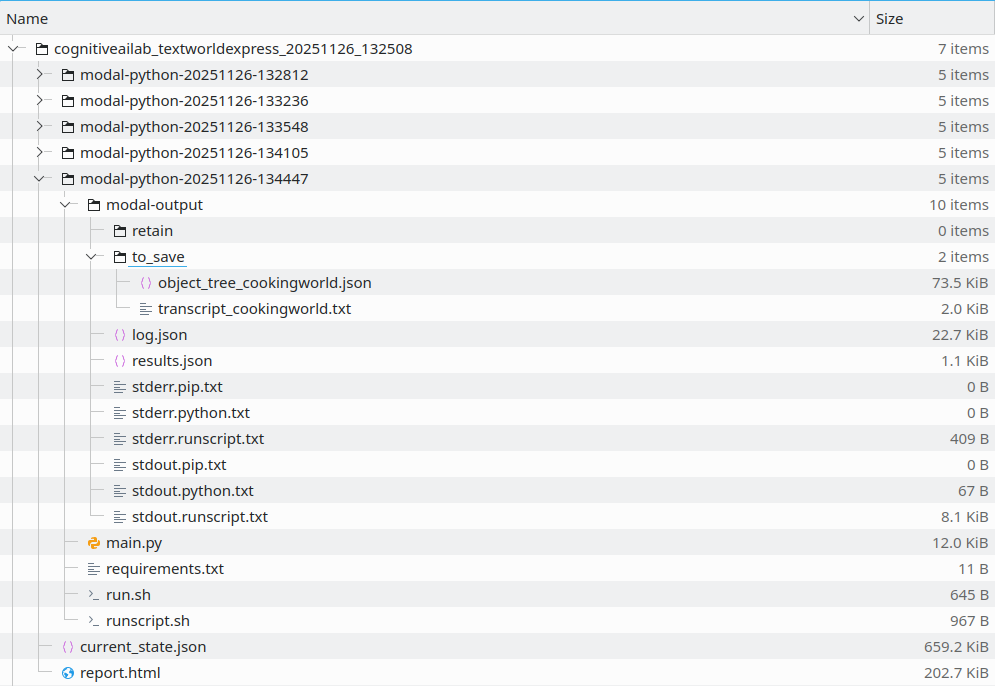
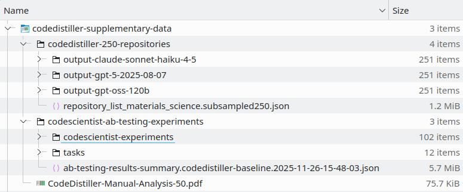
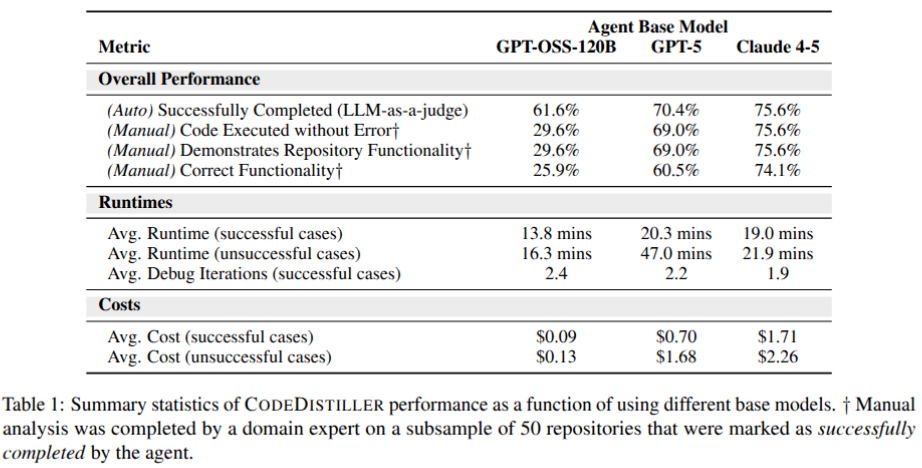
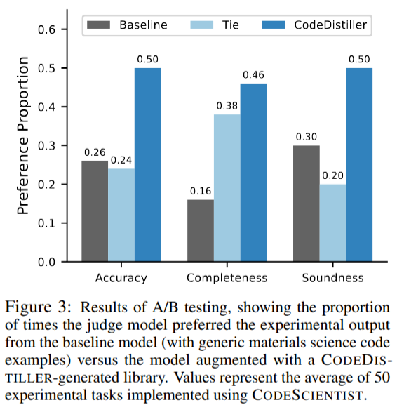
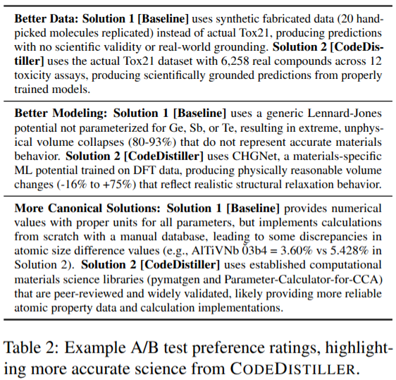

<div align="center">
  
  


</div>


---

This is the repository for **CodeDistiller**, an automated agent designed to convert scientific Github repositories into working code examples suitable for scientific coding agents. 


**CodeDistiller** takes the following input, and produces the following output:
- **Input:** The URLs of one or more Github repositories.
- **Process:** Clones repository, determines its purpose, finds relevant code and documentation, generates examples of core functionality, iteratively debugs those examples until working.
- **Output:** A working example of using the core functionality of a given repository (or set of repositories), including the code, runscripts, output, and a report on the generation process.  You can plug a large number of these examples into Code-RAG-style coding agents, like [CodeScientist](http://www.github.com/allenai/codescientist), to enable them to build more complicated, accurate, and scientifically sound experiments with examples from canonical scientific libraries instead of code generated from the model's parametric knowledge.

What you'll find in this repository: 
- **CodeDistiller Software:** *CodeDistiller* is open source, and this repository includes the full set of software and installation instructions.
- **Data:** The *CodeDistiller* paper evaluates the system performance across a vareity of models, on both the conversion process, as well as a downstream scientific discovery task.  The data for these analyses is readily available here: [Experimental Data from the Paper](#4-experimental-data-from-the-paper).

<div align="center">

</div>

---

## Table of Contents

- [0. Paper](#0-paper)
- [1. Frequently Asked Questions](#1-frequently-asked-questions)
- [2. Installation](#2-installation)
  - [2.1. Setting up the repository](#2-1-setting-up-the-repository)
  - [2.2. Configuration File](#2-2-configuration-file)
  - [2.3. Setting up LLM API keys](#2-3-setting-up-llm-api-keys)
  - [2.4. Setting up Modal](#2-4-setting-up-modal)
- [3. Running CodeDistiller](#3-running-codedistiller)
  - [3.1. Converting a single repository](#3-1-converting-a-single-repository)
  - [3.2. Output for a single repository](#3-2-output-for-a-single-repository)
  - [3.3. Batch Mode/Scaling](#3-3-batch-modescaling)
- [4. Experimental Data from the Paper](#4-experimental-data-from-the-paper)
  - [4.1. Downloading the supplementary data](#4-1-downloading-the-supplementary-data)
  - [4.2. Evaluation: CodeDistiller Performance by Base Model (Table 1)](#4-2-evaluation-codedistiller-performance-by-base-model-table-1)
  - [4.3. Evaluation: Downstream Evaluation on Discovery Tasks (Figure 3 and Table 2)](#4-3-evaluation-downstream-evaluation-on-discovery-tasks-figure-3-and-table-2)
- [5. Danger Zone](#5-danger-zone)
- [6. Citation](#6-citation)
- [7. License](#7-license)
- [8. Contact](#8-contact)


<span id='0-paper'/>

## 0. Paper 

*CodeDistiller* is described in the following paper: [CodeDistiller: Automatically Generating Code Libraries for Scientific Coding Agents](https://arxiv.org/).
<div align="center">

</div>


<span id='1-frequently-asked-questions'/>

## 1. Frequently Asked Questions

#### Q: Are there quick-start instructions for installing and running CodeDistiller?
A: Yes!  Please see [2. Installation](#2-installation) and [3. Running CodeDistiller](#3-running-codedistiller).

#### Q: Is there example output of CodeDistiller?
A: Yes!  750 examples (250 repositories x 3 base models) are available in the supplementary data described in [4.1. Downloading the supplementary data](#4-1-downloading-the-supplementary-data).

#### Q: Can CodeDistiller be run threaded to run at scale (e.g. hundreds or thousands of repositories)?
A: Yes! CodeDistiller can be run threaded, and the experiments reported in the paper were run in this way.  Simply spawn a new thread to call CodeDistiller for each repository.  The total number of threads you can run simultaneously will depend upon the rate limits for your API key for a given model provider, but in practice we have run it with dozens of threads.  Examples for threading are in [3.3. Batch Mode/Scaling](#3-3-batch-modescaling).

#### Q: Some repositories already have examples in them.  Is something like CodeDistiller required in those cases?
A: Yes! Many repositories have minimal or zero documentation or examples, and what documentation they do have may be incomplete, fragmented, or out-of-date, making it very challenging for automated discovery agents to use their functionality as-is.  Only a small subset of scientific Github repositories are well-documented, and contain detailed, useful, and correct instructions for running them in common usage scenarios.   CodeDistiller handles all these use cases, from well-documented to poorly-documented repositories, and works to automatically create and debug useful examples of their core functionality. 

#### Q: Why don't the generated examples run as-is on my MacOS or Windows installation?
A: The code that CodeDistiller generates is run (and iteratively debugged) in a minimal `Ubuntu 24.04 LTS` container, and is likely to require at least minor modification to work in other environments.  Automated Scientific Discovery agents typically run their code in containers, so this is very useful for the downstream use case of automated scientific discovery/automated coding agents.  Depending on the repository, the code is generally portable from Ubuntu Linux to MacOS with minimal effort, and to Windows with somewhat more effort.  Since the container is minimal, the runscript often installs even basic-level tools (e.g. `git`, `wget`), then installs libraries using a `conda`, which should increase their portability.

#### Q: Is CodeDistiller example generation deterministic?
A: This depends on whether the base model and repository functionality is deterministic, but most of the time, the answer is likely no.  That means that each time you run CodeDistiller on a repository, you are likely to get slightly different examples, and it may take different amounts of debug iteratations to generate the result.  

#### Q: How much does it cost to run CodeDistiller?
A: In general, CodeDistiller runs tend to cost between $2 to $4 per attempt per repository on Claude-4.5 / GPT-5 class models at the hyperparameters used in the paper.  But this is only an estimate, and actual costs can vary substantially.  There is no easy way to predict the costs of a specific run, as this depends on many facts (such as the token count of the repository), but the costs do increase as the number of debug iterations increases.  In addition to LLM costs, there are also small costs associated with using cloud containers on Modal.com, but these costs are usually very small in relation to the LLM API costs.

#### Q: How long does it take CodeDistiller to make example code?
A: This depends on the repository and the run, but the average time is about 20 minutes per repository.


<span id="2-installation"/>

## 2. Installation


<span id="2-1-setting-up-the-repository"/>

### 2.1. Setting up the repository

Step 1: Clone the repository:
   ```bash
   git clone https://github.com/cognitiveailab/codedistiller
   cd codedistiller
   ```

Step 2: Create the conda environment: 
   ```bash
   conda create --name=codedistiller python=3.12
   ```

Step 3: Activate the environment
   ```bash
   conda activate codedistiller
   ```

Step 4: Install requirements
   ```bash
   pip install -r requirements.txt
   ```


<span id="2-2-configuration-file"/>

### 2.2. Configuration File

You will need to supply `CodeDistiller` with a JSON configuration file that describes the following parameters: 
- `model_str_code`: The model to use for the code generation and debuging components.  This is typically a large, performant model. 
- `model_str_fast`: The model to use for file classification.  This is typically a fast, inexpensive model. 
- `max_runtime_mins`: The maximum runtime for each debug iteration, in minutes. 
- `max_debug_iterations`: The maximum number of times the code can go through the generate-execute-reflect debugging cycle.
- `output_base_path`: The base output path to export the output.  A repository-specific subdirectory will be generated in this path.

Several example configurations from the paper are pre-supplied, including `config-claude45.json`: 

   ```json
   {
       "model_str_code": "claude-sonnet-4-5-20250929",
       "model_str_fast": "claude-haiku-4-5-20251001",
       "max_runtime_mins": 45,
       "max_debug_iterations": 8,
       "output_base_path": "output-claude-sonnet-haiku-4-5/"    
   }
   ```


<span id="2-3-setting-up-llm-api-keys"/>

### 2.3. Setting up LLM API keys

You will need to supply API keys for whichever model you plan to use.  These are typically set as provider-specific environment variables (for example, `OPENAI_API_KEY`, `ANTHROPIC_API_KEY`, and so forth).

If CodeDistiller fails with the following error, then it likely means the API keys for the selected provider were not set:
```
ERROR: Authentication error when querying LLM model. Please check your API keys.
ERROR MESSAGE:
litellm.AuthenticationError: Missing Anthropic API Key - A call is being made to anthropic but no key is set either in the environment variables or via params. Please set `ANTHROPIC_API_KEY` in your environment vars
```


<span id="2-4-setting-up-modal"/>

### 2.4. Setting up Modal

The code that *CodeDistiller* creates is not run locally, but rather on containers provided by the cloud service [modal.com](http://www.modal.com).  This allows *CodeDistiller* to run in parallel at scale, or using resources that are not present on the host machine.  To use *CodeDistiller*, you will need to sign up for a Modal account.  At the time of this writing, Modal.com provides a small amount of free credits per month, which is generally enough to run a small-to-moderate number of CPU-only runs.

To setup Modal, visit [modal.com](http://www.modal.com) and follow their sign-up and setup instructions.  This nominally looks something like:

- Sign up for a free-tier Modal.com account
- Run `pip install modal` to install their package
- Run `modal setup` to authenticate

The instructions may have changed when you read this -- it's recommended you follow the latest version of their sign-up and setup procedure.


<span id="3-running-codedistiller"/>

## 3. Running CodeDistiller


<span id="3-1-converting-a-single-repository"/>

### 3.1. Converting a single repository

Once setup, running CodeDistiller is straightforward.  From the main directory of the repository, simply run the following command: 

```bash
python src/codedistiller.py <repository_url> <configuration_file>
```

For example: 

```bash
python src/codedistiller.py https://github.com/cognitiveailab/textworldexpress config-gpt5.json
```

CodeDistiller will:
- Clone the repository into a scratch directory (`/scratch/`)
- Scan the files in the repository to determine its purpose and identify the most relevant files to build examples from.
- Build, execute, and debug code examples (the `modal-` subdirectories).
- Generate a report when completed (`report.html`). 
- The output will be placed in the output path listed in the configuration file.  A new subdirectory will be made that is verbose, including the repository name and a timestamp. 


<span id="3-2-output-for-a-single-repository"/>

### 3.2. Output for a single repository

The following is an example output directory: 

<div align="center">

</div>

Here: 
- A human-readable summary file is available (`report.html`), that includes summary statistics, code, results, and other output. 
- A machine-readable summary is also available (`current_state.json`)
- The finished verison of the code is in the most recent `modal` directory, here `modal-python-20251126-134447`.
- The code (`main.py`), requirements (`requirements.txt`), runscript (`run.sh`, a static runscript that calls `runscript.sh`, a runscript that CodeDistiller creates) are in the modal directory.
- The code instrumentation (`log.json`, `stdout/stderr`) and raw results (`results.json`) are in the `modal-output` subfolder of the modal directory.
- Any human-intended files that demonstrate the functionality are provided in the `to_save` subfolder of `modal-output`. 


<span id="3-3-batch-modescaling"/>

### 3.3. Batch Mode/Scaling

If you'd like to run CodeDistiller on a large number of repositories, it's likely that you'd prefer to run it in parallel to reduce the amount of time required.  For example, the runs in the paper were run with 10-20 instances of CodeDistiller running in parallel.  Generally, this is limited primarily by the rate limit of your LLM provider. 

There are two common ways of running jobs in parallel:
- **Job scheduler (e.g. Slurm):** If you're running on a machine with a job scheduler, then you can run jobs in parallel with the job scheduler as normal.
- **Manually submit with a script:** Alternatively, an example Python script that takes in a list of repositories and spawns *N* instances of CodeDistiller is available in [src/codedistiller_run_batch.py](src/codedistiller_run_batch.py).  If you go this route, make sure to test on a small scale to ensure your conda environment, environment variables, and other requirements are processed correctly as new subprocesses are spawned. 


<span id="4-experimental-data-from-the-paper"/>

## 4. Experimental Data from the Paper


<span id="4-1-downloading-the-supplementary-data"/>

### 4.1. Downloading the supplementary data

The supplementary data can be downloaded from here:
[Supplementary Data Download (ZIP, 498MB)](https://drive.google.com/file/d/1fr4FHqVxOgAwrqmpjdAwLz360uNcttyp/view?usp=sharing)

It has the following structure:
<div align="center">

</div>


<span id="4-2-evaluation-codedistiller-performance-by-base-model-table-1"/>

### 4.2. Evaluation: CodeDistiller Performance by Base Model (Table 1)

Table 1 shows overall CodeDistiller performance on the example generation task across a set of popular base models at different price/performance points: 

<div align="center">

</div>

- The output of each of the 750 CodeDistiller runs (250 per base model) can be found in the `codedistiller-250-repositories` folders. Each repository folder contains the normal CodeDistiller output, including (a) overall human-readable `report.html` summary, (b) modal directories for each debug iteration, with the directory with the latest timestamp having the finished version of the code, (c) the experiment logs, results, and output are included in the `modal-output` subfolders.
- A list of the 250 repositories that were randomly selected (`repository_list_materials_science.subsampled250.json`).
- Each output folder for the base models (`GPT-OSS-120B`, `GPT-5`, `Claude-4-5`) contains a `summary_analysis.json` file with summary statistics across the 250 runs, used to compute Table 1.
- The manual analysis spreadsheet by the domain expert is included in `CodeDistiller-Manual-Analysis-50.pdf`, which is used for the manual analysis portions of Table 1.


<span id="4-3-evaluation-downstream-evaluation-on-discovery-tasks-figure-3-and-table-2"/>

### 4.3. Evaluation: Downstream Evaluation on Discovery Tasks (Figure 3 and Table 2)

Figure 3 shows compares the performance of an automated scientific discovery agent (CodeScientist) both with and without using a library of code examples generated from CodeDistiller. 

<div align="center">

</div>

- The 60 problems are in `codescientist-ab-testing-experiments/tasks`.  Each file represents one repository selected by the materials science domain expert as likely having minimal external data requirements, and suitable for generating tasks from.  Within each file there are 5 separate discovery tasks.
- The CodeScientist experiments used in the A/B testing are in the `codescientist-ab-testing-experiments/codescientist-experiments/` folder. Matched raw `baseline` and `codedistiller` experiments can be identified by looking at their problem index (i.e. `experimentplanidx1`), with the baseline experiments containing `baseline` in the folder name.
- The A/B testing scores, explanations, and overall results are in `ab-testing-results-summary.codedistiller-baseline.2025-11-26-15-48-03.json`.
- Small Errata: (a) The problems are indexed as 1-75, but only 60 are used. A number of problems were generated for regular code examples packaged with CodeScientist (e.g. logging, matplotlib, graphviz) but were discluded as these were trivial and not materials science related. (b) The paper notes that 50 of 60 matched pairs of baseline and experimental pairs were selected based on both successfully completing.  The actual figure is 51 of 60, but 1 run failed to successfully complete through the A/B test due to an error (likely due to the prompt being too long, or taking too long to process). 

<div align="center">

</div>

- The examples from Table 2 are drawn from `ab-testing-results-summary.codedistiller-baseline.2025-11-26-15-48-03.json`.
- The `responses` key for each problem contains the results of the blind A/B test, with two runs per problem (counterbalanced for presentation order -- in one run, the baseline output is shown first and the codedistiller output second, in the second run the order is reversed).  


<span id="5-danger-zone"/>

## 5. Danger Zone

This software is an autonomous agent that makes a significant number of LLM calls. While this code includes cost estimation tools, these are only estimates, and nothing is foolproof.

The only API keys you should provide to *CodeDistiller* are those with hard limits, and you should continually monitor your API key usage to measure the actual system cost.


<span id="6-citation"/>

## 6. Citation

If you use this work, please reference the following citation:
```
TODO
```


<span id="7-license"/>

## 7. License

CodeDistiller is released under an Apache 2.0 License.  The text of that license is included in this repository.

```
Disclaimer of Warranty. Unless required by applicable law or
agreed to in writing, Licensor provides the Work (and each
Contributor provides its Contributions) on an "AS IS" BASIS,
WITHOUT WARRANTIES OR CONDITIONS OF ANY KIND, either express or
implied, including, without limitation, any warranties or conditions
of TITLE, NON-INFRINGEMENT, MERCHANTABILITY, or FITNESS FOR A
PARTICULAR PURPOSE. You are solely responsible for determining the
appropriateness of using or redistributing the Work and assume any
risks associated with Your exercise of permissions under this License.
```


<span id="8-contact"/>

## 8. Contact

For any questions, please contact Peter Jansen (`peterj@arizona.edu`).  For issues, bugs, or feature requests, please submit a [github issue](https://github.com/cognitiveailab/codedistiller/issues).
